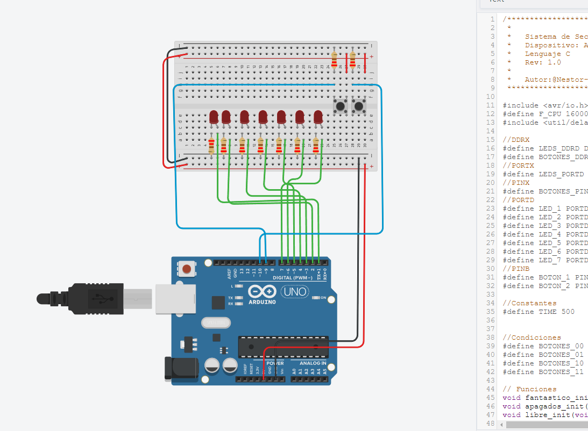

# Secuencia de LEDs con Arduino Uno

Este proyecto implementa una secuencia de control de 7 LEDs utilizando un Arduino R3 (ATmega328P). La secuencia de LEDs es controlada por dos botones que permiten cambiar entre diferentes modos de operación.

## Modos de Operación:

- **Modo 00 (Botón 1 y Botón 2 sin presionar):** Este modo activa un efecto de desplazamiento automático de luces, conocido como "efecto auto fantástico". Los LEDs se encienden y apagan secuencialmente, creando un efecto visual atractivo. La velocidad de desplazamiento es de 0.5 segundos.

- **Modo 01 (Botón 1 presionado y Botón 2 sin presionar):** En este modo, todos los LEDs están apagados.

- **Modo 10 (Botón 1 sin presionar y Botón 2 presionado):** Este modo activa una secuencia de luces libre, donde los LEDs se encienden y apagan en un patrón específico.

- **Modo 11 (Botón 1 y Botón 2 presionados):** Todos los LEDs están encendidos simultáneamente.

## Simulación en Tinkercad:

Puedes visualizar una simulación de este proyecto en Tinkercad "Haz click en la imagen":

