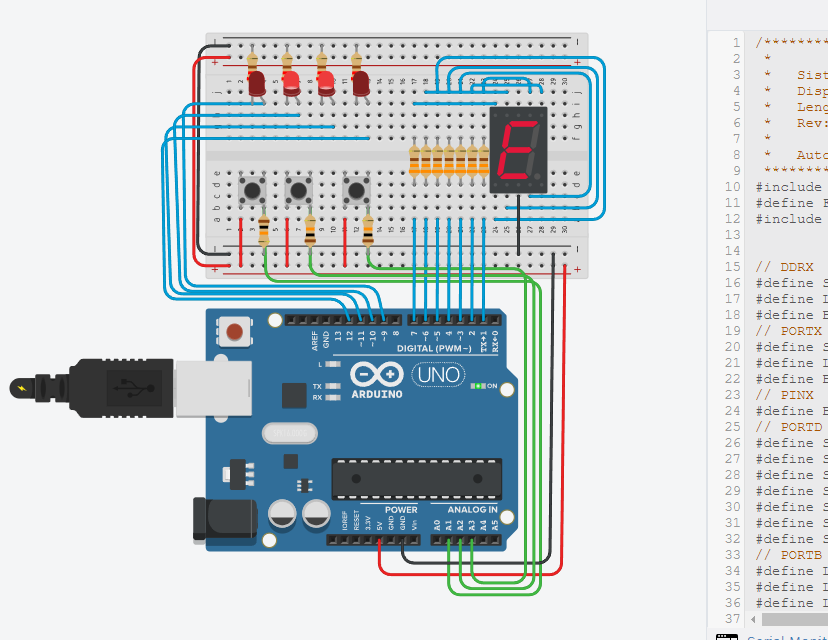

# Secuencia de LEDs y Display de 7 Segmentos con Arduino Nano

Este proyecto implementa una secuencia de control de 4 LEDs y un display de 7 segmentos utilizando un Arduino Nano (ATmega328P). La secuencia de LEDs y los caracteres mostrados en el display son controlados por 3 botones que permiten cambiar entre diferentes modos de operación.

## Modos de Operación:

- **Modo 000 (Botón 1, Botón 2 y Botón 3 sin presionar):** Muestra la letra "E" en el display de 7 segmentos y activa una secuencia de encendido de LEDs. Los LEDs del medio se encienden primero, seguidos por los de las orillas.

- **Modo 001 (Botón 1 sin presionar, Botón 2 sin presionar y Botón 3 presionado):** Muestra el número "1" en el display de 7 segmentos y activa una secuencia de desplazamiento de LED. Un solo LED se desplaza de izquierda a derecha.

- **Modo 010 (Botón 1 sin presionar, Botón 2 presionado y Botón 3 sin presionar):** Muestra el número "2" en el display de 7 segmentos y activa una secuencia de desplazamiento de LED. Un solo LED se desplaza de derecha a izquierda.

- **Modo 011 (Botón 1 sin presionar, Botón 2 presionado y Botón 3 presionado):** Muestra la letra "P" en el display de 7 segmentos y activa una secuencia en la que todos los LEDs parpadean.

- **Modo 1XX (Botón 1 presionado, Botón 2 y Botón 3 sin presionar):** Muestra la letra "F" en el display de 7 segmentos y activa una secuencia en la que todos los LEDs están completamente encendidos.

## Simulación en Tinkercad:

Puedes visualizar una simulación de este proyecto en Tinkercad "Haz click en la imagen":

